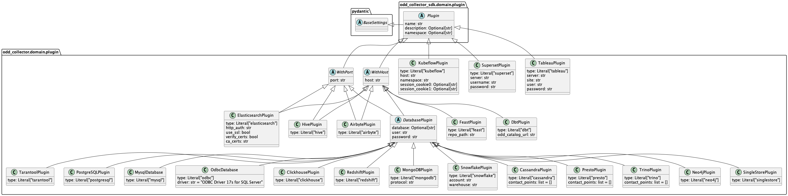

[](https://github.com/psf/black)
# odd-collector
ODD Collector is a lightweight service that gathers metadata from all your data sources.

To learn more about collector types and ODD Platform's architecture, [read the documentation](https://docs.opendatadiscovery.org/architecture).

## Preview:
 - [Implemented adapters](#implemented-adapters)
 - [Class diagramm](#class-diagram-of-adapter-class-hierarchy)
 - [Building](#building)
 - [M1 building issue](#m1-building-issue)
 - [Docker compose example](#docker-compose-example)

## Implemented adapters
| Service                                     | Config example                                                                          |
|---------------------------------------------|-----------------------------------------------------------------------------------------|
| Cassandra      <a name="cassandra"></a>     | [config](config_examples/cassandra.yaml)                                                |
| ClickHouse     <a name="clickhouse"></a>    | [config](config_examples/clickhouse.yaml)                                               |
| Dbt            <a name="dbt"></a>           | [config](config_examples/dbt.yaml)                                                      |
| Elasticsearch  <a name="elasticsearch"></a> | [config](config_examples/elasticsearch.yaml)                                            |
| Feast          <a name="feast"></a>         | [config](config_examples/feast.yaml)                                                    |
| Hive           <a name="hive"></a>          | [config](config_examples/hive.yaml)                                                     |
| Kafka          <a name="kafka"></a>         | [config](config_examples/kafka.yaml)                                                    |
| Kubeflow       <a name="kubeflow"></a>      | [config](config_examples/kubeflow.yaml)                                                 |
| MariaDB        <a name="mariadb"></a>       | [config](config_examples/mysql.yaml), _supported via MySql adapter_                     |
| MongoDB        <a name="mongodb"></a>       | [config](config_examples/mongodb.yaml)                                                  |
| MSSql          <a name="mssql"></a>         | [config](config_examples/mssql.yaml)                                                    |
| MySql          <a name="mysql"></a>         | [config](config_examples/mysql.yaml)                                                    |
| Neo4j          <a name="neo4j"></a>         | [config](config_examples/neo4j.yaml)                                                    |
| PostgreSQL     <a name="postgresql"></a>    | [config](config_examples/postgresql.yaml)                                               |
| Presto         <a name="presto"></a>        | [config](config_examples/presto.yaml)                                                   |
| Redash         <a name="redash"></a>        | [config](config_examples/redash.yaml)                                                   |
| Redshift       <a name="redshift"></a>      | [config](config_examples/redshift.yaml)                                                 |
| Snowflake      <a name="snowflake"></a>     | [config](config_examples/snowflake.yaml)                                                |
| Superset       <a name="superset"></a>      | [config](config_examples/superset.yaml)                                                 |
| Tableau        <a name="tableau"></a>       | [config](config_examples/tableau.yaml)                                                  |
| Tarantool      <a name="tarantool"></a>     | [config](config_examples/tarantool.yaml)                                                |
| Trino          <a name="trino"></a>         | [config](config_examples/trino.yaml)                                                    |
| Vertica        <a name="vertica"></a>       | [config](config_examples/vertica.yaml)                                                  |
| ODBC           <a name="odbc"></a>          | [config](config_examples/odbc.yaml), [README.md](odd_collector/adapters/odbc/README.md) |
| Cube           <a name="cubejs"></a>        | [config](config_examples/cubejs.yaml)                                                   |
| ODD Adapter    <a name="odd-adapter"></a>   | [config](config_examples/odd_adapter.yaml)                                              |
| Druid Adapter  <a name="druid"></a>         | [config](config_examples/druid.yaml)                                                    |


## Class diagram of adapter class hierarchy
This may help you to understand which fields you need for each adapter in `collector_config.yaml` and also may be helpful for a new adapter developer.


PlantUML code for above diagram: [domain_classes.plantuml](domain_classes.plantuml)

To regenerate picture, you have 2 options:
1. Having PlantUML installed locally, do
```shell
java -jar plantuml.jar domain_classes.plantuml
```
2. Use PyCharm or other IDE's PlantUML plugin


## Building
```bash
docker build .
```

## M1 building issue

**libraries** `pyodbc` , `confluent-kafka` and `grpcio`   have problem during installing and building project on Mac M1.

- https://github.com/mkleehammer/pyodbc/issues/846
- https://github.com/confluentinc/confluent-kafka-python/issues/1190
- https://github.com/grpc/grpc/issues/25082

Possible solutions
```bash
# NOTE: be aware of versions
# NOTE: easiest way is to add all export statements to your .bashrc/.zshrc file

# pyodbc dependencies
brew install unixodbc freetds openssl

export LDFLAGS="-L/opt/homebrew/lib  -L/opt/homebrew/Cellar/unixodbc/2.3.11/include -L/opt/homebrew/opt/freetds/lib -L/opt/homebrew/opt/openssl@3/lib"
export CFLAGS="-I/opt/homebrew/Cellar/unixodbc/2.3.11/include -I/opt/homebrew/opt/freetds/include"
export CPPFLAGS="-I/opt/homebrew/include -I/opt/homebrew/Cellar/unixodbc/2.3.11/include -I/opt/homebrew/opt/openssl@3/include"

# cunfluent-kafka
brew install librdkafka

export C_INCLUDE_PATH=/opt/homebrew/Cellar/librdkafka/1.9.0/include
export LIBRARY_PATH=/opt/homebrew/Cellar/librdkafka/1.9.0/lib
export PATH="/opt/homebrew/opt/openssl@3/bin:$PATH"

# grpcio
export GRPC_PYTHON_BUILD_SYSTEM_OPENSSL=1
export GRPC_PYTHON_BUILD_SYSTEM_ZLIB=1
```

## Docker compose example
Custom `.env` file for docker-compose.yaml
```
LOGLEVEL=DEBUG
PLATFORM_HOST_URL=http://odd-platform:8080
POSTGRES_PASSWORD=postgres_password_secret
```

There are 3 options for config field pass:
1. Explicitly set it in `collector_config.yaml` file, i.e `database: odd-platform-db`
2. Use `.env` file or ENV variables
3. In situation when plugins have same field names, we can  explicitly set ENV variable to `collector_config.yaml`, i.e. `password: !ENV ${POSTGRES_PASSWORD}`

Custom `collector-config.yaml`
```yaml
platform_host_url: http://localhost:8080
default_pulling_interval: 10
token: ""
plugins:
  - type: postgresql
    name: test_postgresql_adapter
    host: "localhost"
    port: 5432
    database: "some_database_name"
    user: "some_user_name"
    password: !ENV ${POSTGRES_PASSWORD}
  - type: mysql
    name: test_mysql_adapter
    host: "localhost"
    port: 3306
    database: "some_database_name"
    user: "some_user_name"
    password: "some_password"
```

docker-compose.yaml
```yaml
version: "3.8"
services:
  # --- ODD Platform ---
  database:
    ...
  odd-platform:
    ...
  
  odd-collector:
    image: ghcr.io/opendatadiscovery/odd-collector:latest
    restart: always
    volumes:
      - collector_config.yaml:/app/collector_config.yaml
    environment:
      - PLATFORM_HOST_URL=${PLATFORM_HOST_URL}
      - POSTGRES_PASSWORD=${POSTGRES_PASSWORD}
    depends_on:
      - odd-platform
```
